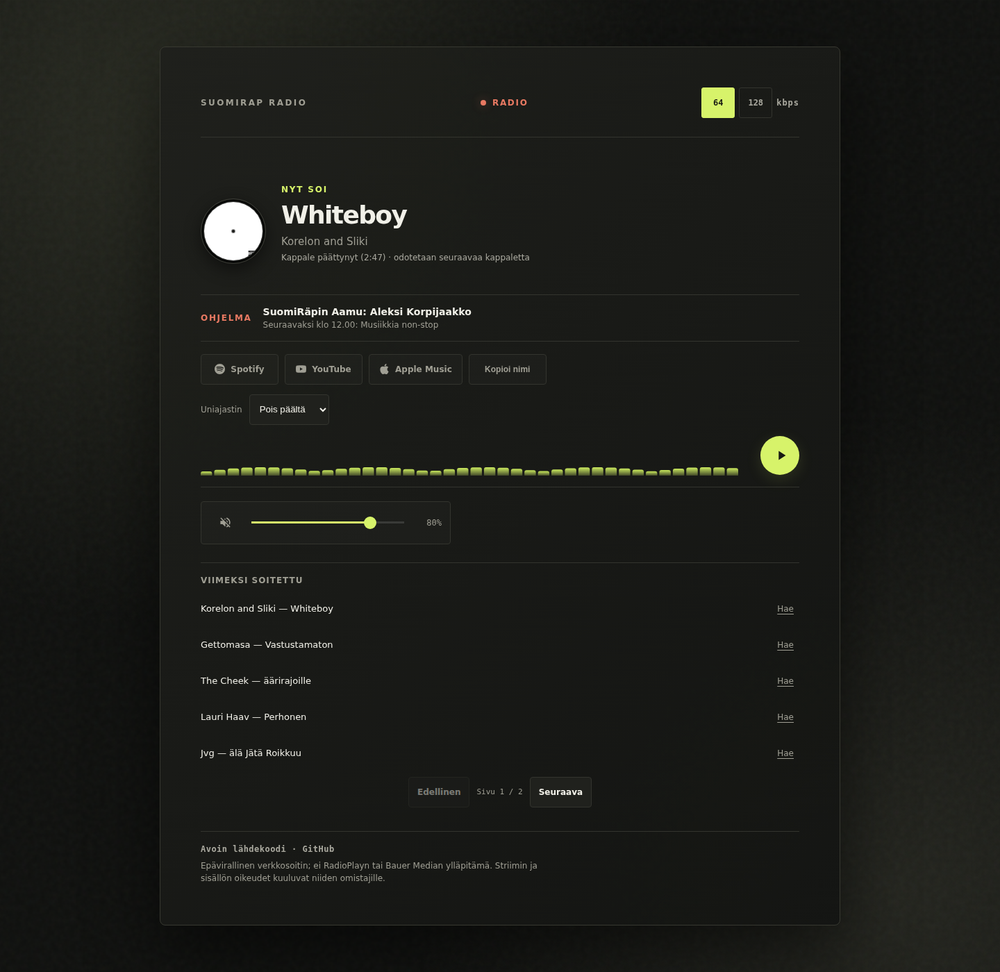

# Suomirap Radio

An unofficial Vercel-hosted stream redirect and web player for Suomirap. It is not operated, sponsored, or approved by RadioPlay or Bauer Media.



> Music, artwork, station branding, and stream rights remain with their respective owners. This repository's MIT license covers only its original source code; it does not grant rights to Bauer's stream or media.

## Features

- 64 kbps AAC and 128 kbps MP3 stream choices delivered through a dedicated IP-and-port HTTPS proxy.
- Reads ICY track changes from each listener's own audio stream, so the displayed track and timer follow the audio rather than polling time offsets.
- Responsive dark player with playback state, volume, audio visualizer, album artwork, and a fallback cover.
- Track and artist metadata, current and next scheduled show, service search links, copy/share actions, and a sleep timer.
- Track time stops at the reported duration; if the next track metadata has not arrived, the player shows that it is waiting instead of counting through a possible talk/ad break.
- Track history is at the bottom of the player, with at most five entries per page.
- Keyboard shortcuts: Space toggles playback, `M` toggles mute, and Up/Down adjusts volume when focus is not in a form control.
- Media Session metadata and media-button play/pause support where the browser provides the API.
- Remembered quality and volume settings. Storage failures are handled without preventing playback.
- An API health endpoint, parser fixtures and tests, CI checks, and a scheduled GitHub Actions endpoint monitor.

## Important stream-integration notice

The player now uses the standalone HTTPS stream proxy at `https://5.61.90.42:8443/stream`; the proxy forwards only the two allow-listed Bauer stream qualities and exposes ICY metadata to the player. The repository owner states that Bauer authorization was obtained for this relay; that statement is owner-supplied and is not independently verified here.

The legacy `/api/suomirap` redirect retains the existing fixed IAB TCF string for compatibility. It is not collected from each visitor and must not be represented as that visitor's consent. The proxy does not collect or establish individual consent. For official listening and its consent controls, use [RadioPlay Suomirap](https://www.radioplay.fi/suomirap).

## Endpoints

- `/` — web player.
- `https://5.61.90.42:8443/stream?q=64|128` — HTTPS ICY proxy used by the player; only the two configured stream qualities are accepted.
- `/api/suomirap` — legacy 307 redirect to Bauer's stream integration; `?q=64` and `?q=128` select the allow-listed qualities. The web player no longer uses this redirect for audio.
- `/api/nowplaying` — track, artist, HTTPS-validated artwork and Apple Music URL, track start/duration, current and next show. It prefers Bauer's Listen API and falls back to the public station page. Upstream requests have four-second timeouts; the station schedule is cached in a warm function instance for five minutes.
- `/api/health` — no-store liveness response. It does not make an upstream Bauer request.

The metadata endpoint uses a short shared cache and serves best-effort stale data during upstream errors when a warm function instance has a previous successful result. The serverless instance cache is not durable storage.

## Development

Requires Node.js 22.x.

```bash
npm install
npm run check
npm test
```

`npm run check` validates the static HTML shell, player JavaScript and utilities, configured security headers and required assets, runs syntax checks, and checks Prettier formatting. `npm test` runs the built-in Node test runner against API fixtures, endpoint behavior, ICY title parsing and matching, track timing, and history pagination.

The browser player uses the unmodified `icecast-metadata-player` 1.17.13 distribution to parse ICY metadata on the audio stream. Its LGPL-3.0-or-later license and source are included under `vendor/icecast-metadata-player-1.17.13/`; the local browser build is under `public/vendor/icecast-metadata-player-1.17.13/`.

GitHub Actions runs the checks on pushes to `master` and pull requests. A scheduled monitor checks the deployed `/api/health` and `/api/nowplaying` endpoints every 15 minutes, opens one issue when a check fails, and closes it after recovery. It uses GitHub's own issue/API logs; no third-party telemetry service is installed.

## Deployment

The canonical deployment used in metadata and monitoring is:

```text
https://suomirap-redirect.vercel.app/
```

The project can be imported into Vercel with the Git repository. If Git-based deployments are enabled and `master` is the production branch, pushing to `master` triggers deployment. Actual deployment behavior depends on the Vercel project settings.

## Operational choices and limits

- The functions use Vercel's Node request/response handler contract; the redirect has not been moved to Edge Runtime. Do not assume an Edge conversion is faster or cheaper without profiling and adapting the handler contract.
- There is no blanket rate limit on the public stream URL; a per-IP limit could interrupt directory listings and listeners, and this project has no shared rate-limit store. Monitor Vercel function usage before adding one.
- iOS volume uses a Web Audio `GainNode`. Desktop Chromium playback and UI were browser-tested; playback, AirPlay, and background audio still need testing on a physical iPhone/Safari device.
- AirPlay is exposed only when the browser offers its native target-picker API. Chromecast is not included.

## License

The repository's original code is MIT-licensed (see `LICENSE`). The vendored `icecast-metadata-player` 1.17.13 browser library is separately licensed under LGPL-3.0-or-later; see its included `LICENSE` and source under `vendor/`. Bauer/RadioPlay streams, station marks, artwork, and metadata remain subject to their owners' terms and rights.
